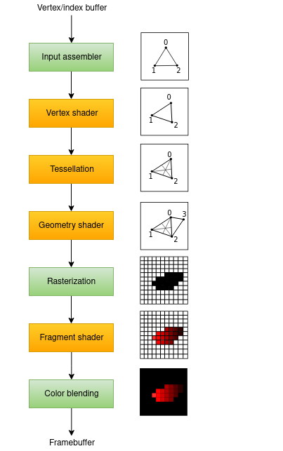

1. Graphics pipeline:  
   Now, when all underlying stuff is configured, we need to configure graphics
   pipeline to actually draw something. Vulkan is special about this, as all
   graphics pipeline need to be configured and created in a strict manner
   before using them, and there is not so much flexibility to change the
   pipeline. Basically, the pipeline is being baked in a solid state. But the
   benefit of this is just like with compiled over interpreted programming
   languages - speed.
2.

- The input assembler collects the raw vertex data from the buffers you specify
  and may also use an index buffer to repeat
  certain elements without having to duplicate the vertex data itself.

- The vertex shader is run for every vertex and generally applies
  transformations to turn vertex positions from model
  space to screen space. It also passes per-vertex data down the pipeline.

- The tessellation shaders allow you to subdivide geometry based on certain
  rules to increase the mesh quality. This is
  often used to make surfaces like brick walls and staircases look less flat
  when they are nearby.

- The geometry shader is run on every primitive (triangle, line, point) and can
  discard it or output more primitives than
  came in. This is similar to the tessellation shader, but much more flexible.
  However, it is not used much in today’s
  applications because the performance is not that good on most graphics cards
  except for Intel’s integrated GPUs.

- The rasterization stage discretizes the primitives into fragments. These are
  the pixel elements that they fill on the
  framebuffer. Any fragments that fall outside the screen are discarded and the
  attributes outputted by the vertex shader
  are interpolated across the fragments, as shown in the figure. Usually the
  fragments that are behind other primitive
  fragments are also discarded here because of depth testing.

- The fragment shader is invoked for every fragment that survives and determines
  which framebuffer(s) the fragments are
  written to and with which color and depth values. It can do this using the
  interpolated data from the vertex shader,
  which can include things like texture coordinates and normals for lighting.

- The color blending stage applies operations to mix different fragments that
  map to the same pixel in the framebuffer.
  Fragments can simply overwrite each other, add up or be mixed based upon
  transparency.

3. Stages with a green color are known as fixed-function stages. These stages
   allow
   you to tweak their operations using
   parameters, but the way they work is predefined.

4. Stages with an orange color on the other hand are programmable, which means
   that
   you can upload your own code to the
   graphics card to apply exactly the operations you want. This allows you to
   use
   fragment shaders, for example, to
   implement anything from texturing and lighting to ray tracers. These programs
   run on many GPU cores simultaneously to
   process many objects, like vertices and fragments in parallel.

Bonus: https://docs.vulkan.org/spec/latest/chapters/pipelines.html