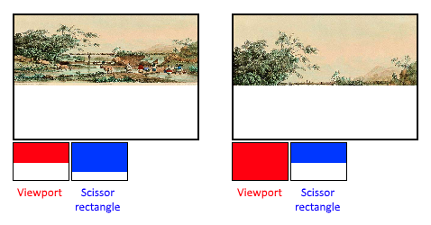

1. Preamble:  
   Vulkan is so explicit, that even stages that you have little-to-no
   control must be explicitly set and created. So, here we will take a look
   on such stages.

2. Dynamic state:  
   A dynamic pipeline state is a state that can be changed by a command buffer
   command during the execution of a command buffer. Examples are the size of
   the viewport, line width and blend constants. Such states are configures via
   `VkPipelineDynamicStateCreateInfo`. If we specify some states in this
   info, those states won't be baked into pipeline, but will need to be
   configured at the runtime, which is really useful for
   `VK_DYNAMIC_STATE_VIEWPORT` and `VK_DYNAMIC_STATE_SCISSOR`.

3. Vertex input:
   This state is configured via `VkPipelineVertexInputStateCreateInfo` -
   this structure describes the format of the vertex data that will be passed
   to the vertex shader. This format can be described in:
    * Bindings: spacing between data and whether the data is per-vertex or
      per-instance (see instancing)
    * Attribute descriptions: type of the attributes passed to the vertex
      shader, which binding to load them from and at which offset
      // TODO: fill after passing real geometry chapter

4. Input assembly:  
   This state is configured via
   `VkPipelineInputAssemblyStateCreateInfo` - and this structure what kind of
   geometry will be drawn from the vertices and if primitive restart should be
   enabled. There are several kinds of geometry that can be drawn:
    * `VK_PRIMITIVE_TOPOLOGY_POINT_LIST`: points from vertices
    * `VK_PRIMITIVE_TOPOLOGY_LINE_LIST`: line from every 2 vertices without
      reuse
    * `VK_PRIMITIVE_TOPOLOGY_LINE_STRIP`: the end vertex of every line is used
      as start vertex for the next line
    * `VK_PRIMITIVE_TOPOLOGY_TRIANGLE_LIST`: triangle from every 3 vertices
      without reuse
    * `VK_PRIMITIVE_TOPOLOGY_TRIANGLE_STRIP`: the second and third vertex of
      every triangle are used as first two vertices of the next triangle

5. Viewports and scissors:  
   Viewport basically describes the region of the framebuffer that
   the output will be rendered to. It is defined with `VkViewport` struct.
   Scissor, on the other hand, specifies which part of the framebuffer will
   be actually drawn, and is set with `VkRect2D`. Here is good image that I
   borrowed from tutorial also: 
   In the pipeline, they are created with
   `VkPipelineViewportStateCreateInfo`, but they also can be set dynamically
   with command which we will also cover. Also, we can specify several
   viewports within this state, so we can make visualization of different
   buffers like in Unreal Engine editor

6. Rasterizer:
   Good explanation from tutorial:
   The rasterizer takes the geometry that is shaped by the vertices from the
   vertex shader and turns it into fragments to be colored by the fragment
   shader. It also performs **depth testing**, face culling and the scissor
   test,
   and it can be configured to output fragments that fill entire polygons or
   just the edges (wireframe rendering). Configured via
   `VkPipelineRasterizationStateCreateInfo`. There are pretty much of
   configurable variables: depthClampEnable, rasterizerDiscardEnable,
   polygonMode, **cullMode**, **frontFace**, depthBias<...>. It would be
   good to
   read [documentation](https://docs.vulkan.org/spec/latest/chapters/primsrast.html)

7. Multisampling:  
   This state is configured via `VkPipelineMultisampleStateCreateInfo`, and
   it configures multisampling, which is one of the ways to perform
   anti-aliasing, bla-bla, if you need
   it - [read the manual](https://docs.vulkan.org/spec/latest/chapters/primsrast.html#primsrast-multisampling)

8. Depth and
   stencil: [1-depth-bufferting.md](../../4-depth-buffering/1-depth-bufferting.md)

9. Color blending:  
   That's interesting state, as it works after fragment shader, and it
   basically responsible for blending colors which were provided by the
   fragment shader with the colors that are already in a **framebuffer**.  
   By the way, a framebuffer is basically a collection of attachments, which
   are used by shaders or some stages (like depth stage using depth
   attachment). The framebuffer holds a swap chain image as a color
   attachment, to which final image is rendered. As you can understand, each
   swap chain image gets its own framebuffer.  
   Anyway, there are two ways to perform color blending: mix the old and new
   value to produce a final color OR combine the old and new value using a
   bitwise operation. Therefore, for each attachment in framebuffer, should
   be its own `VkPipelineColorBlendAttachmentState` struct, which will
   configure how everything is blended. The most common way to use color
   blending is to implement alpha blending, where we want the new color to be
   blended with the old color based on its opacity.
   The `VkPipelineColorBlendStateCreateInfo` structure references the array of
   structures for all of the framebuffers and allows you to set blend constants
   that you can use as blend factors.

10. Pipeline layout:  
    You can use _uniform_ values in shaders, which are globals similar to
    dynamic state variables that can be changed at drawing time to alter the
    behavior of your shaders without having to recreate them. They are commonly
    used to pass the transformation matrix to the vertex shader, or to create
    texture samplers in the fragment shader.  
    These uniform values need to be specified during pipeline creation by
    creating a `VkPipelineLayout` object, which is created with
    `VkPipelineLayoutCreateInfo`. This structure also specifies push constants,
    which are another way of passing dynamic values to shaders. In this 
    chapter will be described more about pipeline layout:
   [1-descriptor-layout-and-buffer.md](../../2-uniform-buffers/1-descriptor-layout-and-buffer.md)
